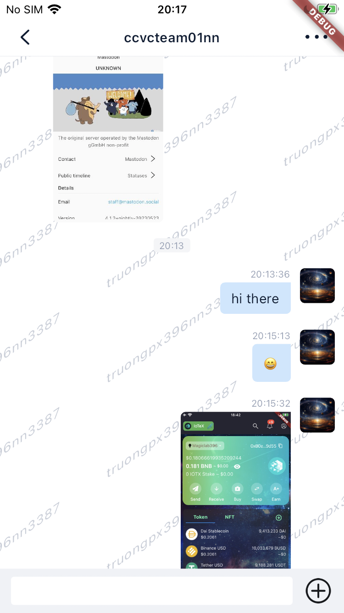

# MobileLabs

## Some Screenshots 🚀

### Crypto Wallet

 
 

 
 

 
 

 
 

---

 
 

 
 

### OpenIM (Instant Messenger App)
[Link To Project Repo](https://github.com/truongpx396/OpenIM-Flutter)

 
 

 
 

### Techshare

